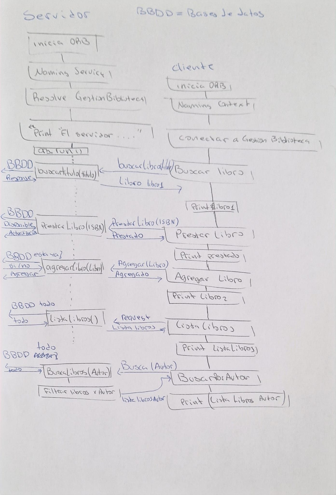

### Práctica de Biblioteca como Sistema Distribuido con CORBA

Este proyecto implementa un sistema de biblioteca distribuida utilizando CORBA.

## Versiones utilizadas

- **Java:** 8
- **Sistema Operativo:** Windows 11

## Ejecución de la Práctica

Para ejecutar el sistema, sigue los siguientes pasos:

### 1. Iniciar el puerto del servicio de nombres
```sh
 tnameserv -ORBInitialPort 1050
```

### 2. Ejecutar el Servidor
```sh
 java ServidorBiblioteca -ORBInitialHost localhost -ORBInitialPort 1050
```

### 3. Ejecutar el Cliente
```sh
 java ClienteBiblioteca -ORBInitialHost localhost -ORBInitialPort 1050
```

## Diagrama de Flujo

A continuación se presenta un diagrama de flujo explicando los componentes y el flujo de datos del sistema:




## Funcionalidades añadidas

📚 listaLibros()

Esta función devuelve un array de libros y muestra en pantalla la siguiente información de cada uno:

Título 📖

Autor ✍️

Estado del libro (📕 Prestado / 📗 Libre)

🔧 Otras Funciones

El resto de las funciones implementadas realizan exactamente lo que indica su nombre.


## Autor
[Gabriel Cárdaba y Javier Revilla]

